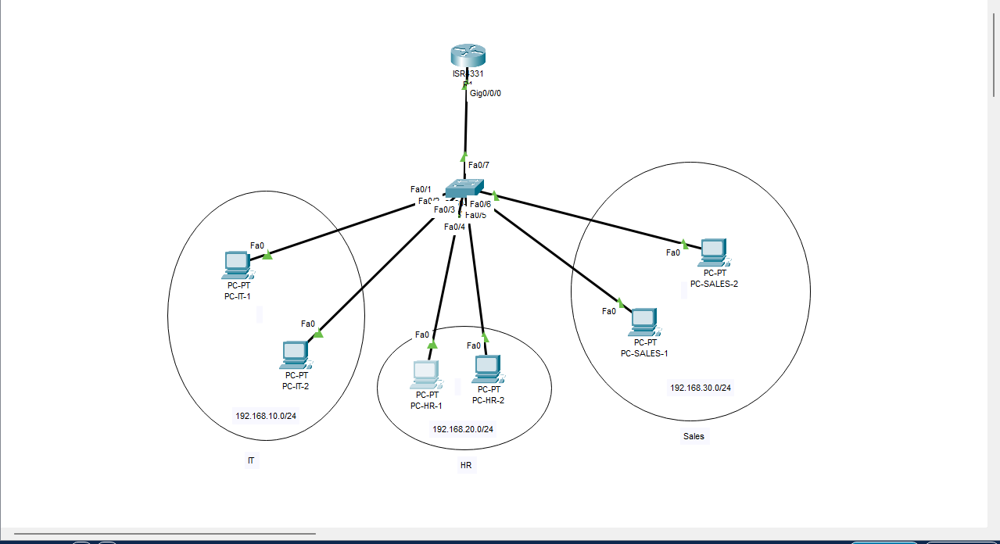

# 🖧 Enterprise Network Simulation (Cisco Packet Tracer)

## 📌 Overview

This project demonstrates the design and implementation of a small enterprise network using Cisco Packet Tracer.
It includes VLAN segmentation, inter-VLAN routing, and access control for improved network security.

---

## 🏢 Network Structure

The network is divided into three departments:

* IT Department (VLAN 10)
* HR Department (VLAN 20)
* Sales Department (VLAN 30)

Each department operates in its own isolated network.

---

## ⚙️ Features

* VLAN segmentation for network isolation
* Inter-VLAN routing using Router-on-a-Stick
* Access Control Lists (ACL) for traffic filtering
* Structured IP addressing scheme

---

## 🖼️ Network Topology

---

## 🔧 Configuration Summary

### Switch Configuration

* VLAN creation (10, 20, 30)
* Port assignment per department
* Trunk configuration to router

### Router Configuration

* Subinterfaces for each VLAN
* 802.1Q encapsulation
* Default gateways for each network

### ACL Configuration

* HR department is restricted from accessing IT resources
* IT department has full access

---

## 🧪 Testing

| Test    | Result    |
| ------- | --------- |
| IT → IT | ✅ Success |
| IT → HR | ✅ Success |
| HR → IT | ❌ Blocked |

---

## 🧠 What I Learned

* How VLANs isolate network traffic
* How routers enable communication between VLANs
* How ACLs enforce network security policies

---

## 📁 Project Files

* `enterprise-network-lab.pkt` (Packet Tracer file)

---

## 🚀 Future Improvements

* Add DHCP server
* Implement DNS
* Add firewall simulation

---
